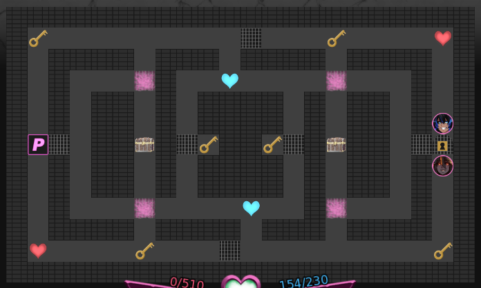

# SearchProblemActivity
## What is this?
Basically, I'm tryna recreate the second level of the Labyrinth minigame from [this game](https://threshold.itch.io/monster-girl-dreams), without the keys and traps though since I wanna keep it simple (and I'm running out of time).  

## How to implement?
Based on my observations of the AI pathing when I played the minigame (only played it twice), Ceris (the red one) generally takes the most direct path to the player while Beris (the blue one) does some interesting maneuvers which makes it look like she's tryna cut off escape routes.  
With this in mind, I'll just assume that Ceris uses BFS, and Beris uses DFS.

## Source:
Took bits and pieces from the MazeSolverDemo example.
